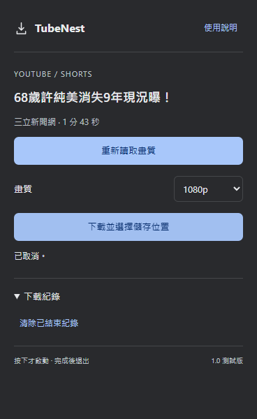

# TubeNest

YouTube 與 Shorts 專用下載工具。Windows 10／11 x64 · Edge／Chrome 127+ · 繁體中文 · 1.0.0 測試版

**下載 → 選畫質 → 選儲存位置。按下才啟動本機助手，完成後退出。**

[下載 Windows 安裝包](https://github.com/OverGreen996/TubeNest/releases/latest) · [實際驗證](VALIDATION.md) · [第三方工具與授權](THIRD-PARTY.md)



## 安裝一次

1. 解壓 `TubeNest-1.0.0-Windows.zip`，執行 `Install.cmd`。
2. 工具會放在 `%LOCALAPPDATA%\TubeNestYouTube`，只為目前帳號註冊，不需要管理員權限。
3. 到 `edge://extensions` 或 `chrome://extensions` 啟用開發人員模式，載入 `%LOCALAPPDATA%\TubeNestYouTube\extension`。
4. 若曾安裝 MediaDock，先移除或停用該擴充，再載入 TubeNest 並重新整理 YouTube。為方便遷移，擴充 ID 沿用 `fhjcedbbonnlkilcklhodjejolannode`，因此兩者不能同時啟用。TubeNest 使用獨立的安裝資料夾及本機助手註冊。

安裝包包含本機助手及擴充。首次安裝會下載官方 yt-dlp、FFmpeg／ffprobe、Deno，核對 GitHub 發行檔的 SHA-256；使用者不用另外安裝 Python、Node.js 或設定 PATH。工具約占用數百 MB 磁碟空間，安裝與更新時需網路。

## 使用

1. 開啟 YouTube 一般影片或 Shorts。
2. 點「分享」旁的下載按鈕，或工具列 TubeNest。
3. 面板會讀取畫質，選想要的畫質，再按「下載並選擇儲存位置」。
4. 在另存新檔視窗選位置。下載、合併、影片 ID／實際畫質／片長及完整影音解碼全部通過，才將完整檔案保存到目的位置。

YouTube 網頁按鈕會跟隨網站深淺色模式，文字及圖示一起切換。Shorts 保留原始直向尺寸。只提供來源實際具備的畫質，不升頻、不自動降畫質、不重新壓縮影像。保存為 MP4，播放程式需支援原始影音編碼。

關閉面板仍會工作，可重新開啟查看進度與取消；關閉瀏覽器會中止助手及其下載工具。一次處理一支影片。下載期間使用 CPU、網路和暫存空間，長影片的完整驗證需要時間。暫存建立在目的資料夾，正常完成／失敗／取消會清理，強制關機可能留下隱藏暫存資料夾。

## 閒置與隱私

沒有開機啟動項、Windows 服務、排程、系統匣圖示或本機 HTTP 伺服器。點下載按鈕或工具列圖示開啟面板時，才透過 Native Messaging 讀取畫質；讀取完成即退出，開始下載再啟動。工作完成便斷開通道，助手及子程序退出。瀏覽器擴充本身仍有少量開銷，不能稱整個瀏覽器零資源。

下載助手不顯示命令視窗或系統匣圖示。畫質面板和使用者主動選擇儲存位置的視窗正常顯示。

權限僅 `activeTab`、`storage`、`nativeMessaging`，網站存取僅 `www.youtube.com`。不讀取、匯出或保存帳號 Cookie，不使用第三方下載網站，不保存播放驗證憑證。不支援 Bili、其他網站、直播／直播回放、DRM 或受保護付費內容。

## 更新與移除

來源限制或驗證拒絕時，執行 `Update.cmd` 更新官方下載工具後重試。更新工具不能保證所有影片都可下載。執行 `Uninstall.cmd` 移除本機助手註冊，再從瀏覽器移除擴充；程式檔案及已下載影片保留，由使用者自行處理。

## 驗證與開發

實際結果與限制見 [VALIDATION.md](VALIDATION.md)，第三方工具來源及授權見 [THIRD-PARTY.md](THIRD-PARTY.md)。本專案採用 yt-dlp 解析 YouTube，FFmpeg 合併及驗證影音；瀏覽器透過 Native Messaging 呼叫本機助手。

開發者才需 Node.js／Playwright；本機助手使用 Windows 內建 .NET Framework 編譯器：

```powershell
pnpm install --frozen-lockfile
pnpm test
pnpm test:ui
.\scripts\Build.ps1
```

`tests/native.mjs --live` 用測試控制程式指定測試目的位置，呼叫正式下載和驗證程式；正式助手沒有測試開關或預設目的位置後門。
